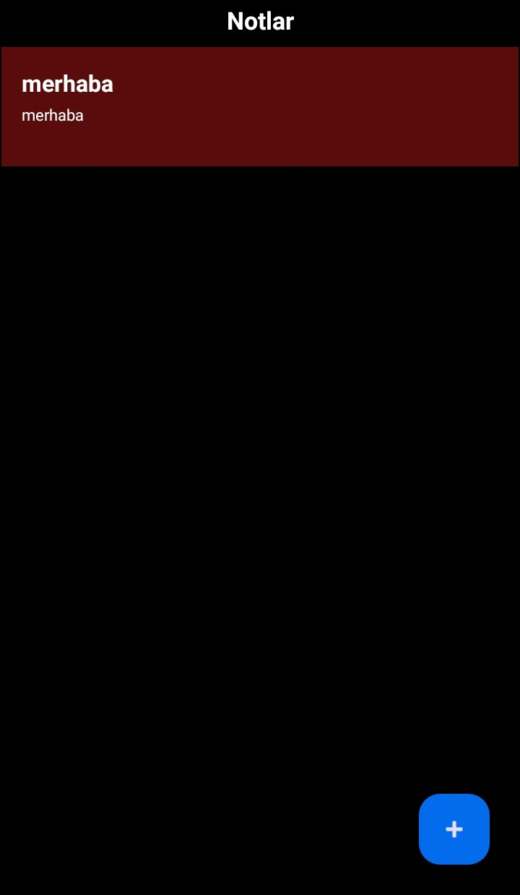
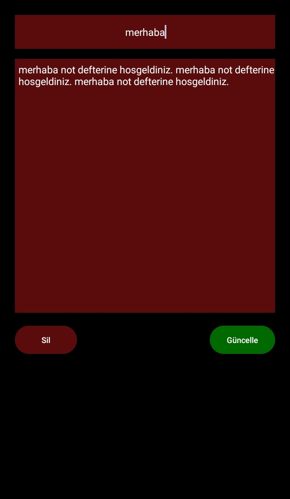
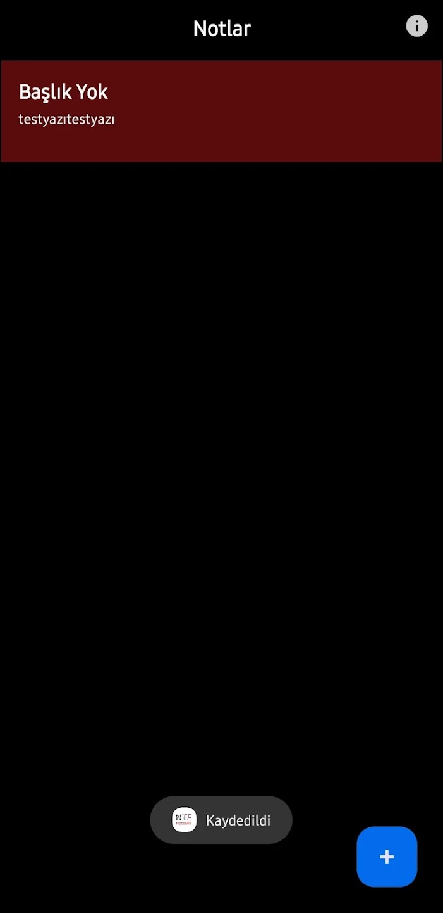
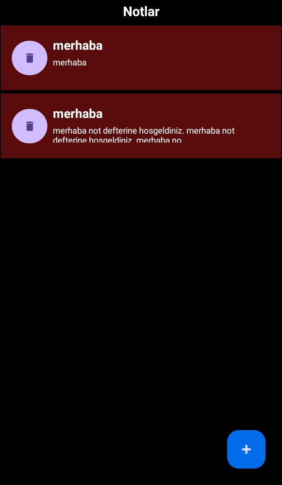

# Android için Not Defteri - Demo
Bu uygulama, geliştirmekte olduğum başka bir projemden aldığım bir örnek-demodur. Android ve Kotlin'i öğrenme sürecim sırasında yazdım.
Uygulamada notları depolamak için SQLite kullandım. Üzerine çok şey eklenebilir ve ekliyorum da, hâlâ geliştiriyorum.

Not Defteri demosu, notların listelendiği ve notların yazılabildiği iki Activity'den oluşan bir uygulamadır:
- Yeni notlar eklenebilir
- Eklenen notlar güncellenebilir
- Notların listelendiği ekrandan basılı tutulduğunda görünen silme butonu ile veya notun yazıldığı ekrandan eklenen notlar silinebilir

| Ana Ekran | Not Listeleme | Not Ekleme ve Güncelleme | Birden Fazla Not | Not Silme |
| ------ | ----- | ------ | ----- | ----- |
|  |  |  |  |  |
